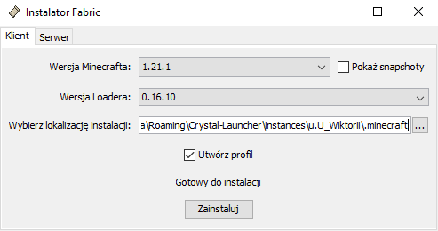
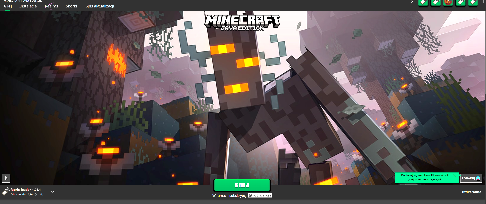
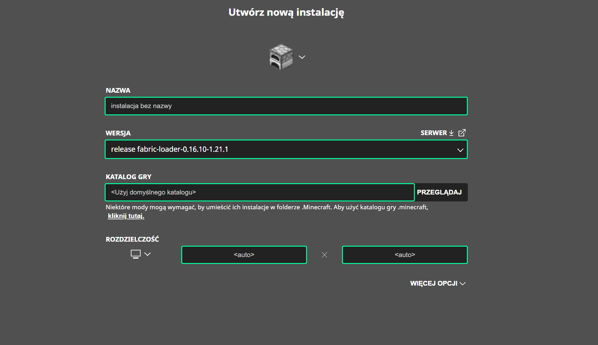

<h1 align="left">Siemano 👋 Witamy na Wiktoriańskiej Masakrze!</h1>

###

To będzie krótki tutorial jak zainstalować mody do Wiktoriańskiej Masakry. Będzie tutaj zarówno wersja premium jak i non-premium na przykładzie Crystal Launchera.

###

<h2 align="left">1. Minecraft</h2>

###

Najważniejsza rzecz jakiej potrzebujecie to Minecraft.  Jeśli ktoś jest kompletnie zielony to może pobrać sobie <a href="https://crystal-launcher.net/p/downloads">Crystal Launchera.</a>

###

<h2 align="left">2. Java</h2>

###

Do działania Minecrafta i fabrica potrzebujecie najnowszej wersji <a href="https://www.java.com/en/download/">Java</a>

###

<h2 align="left">3. Poprawna wersja Minecraft</h2>

###

Musicie mieć odpowiednio skonfigurowaną wersję Minecraft. Serwer działa na wersji 1.21.1 i też taką wersję musicie mieć zainstalowaną.

Poniżej przedstawiam jak to wykonać dla wersji non-premium na przykładzie Crystal Launchera.

###

<h3 align="left">3.1 Crystal Launcher</h3>

###

Dusimy tego przyciska "Zawsze najnowsze wersje". Jak klikniecie "Przeglądaj paczki" to działa tak samo xd.

W górnym menu wybieramy opcję "Paczki Użytkownika" i klikamy przyciska "Nowa paczka lub importowanie".

Wymagane jest nazwanie paczki, jednak jest to tylko dla was i nie ma to znaczenia dla poprawnego działania serwera. Następnie kilkamy zaznaczony przycisk "Zainstaluj Forge, NeoForge, Quilt lub Fabric mod loader."

U góry w API wybierami "FabricaMC" oraz wersję gry 1.21.1. Klikamy dalej i dzieje się magia.

WAŻNE jest teraz odpalanie minecrafta na właśnie tej wersji. Podczas pierwszego uruchomienia instalowanę są niezbędnę pliki który będą potrzebne przy instalowaniu modów i fabrica. Nie musicie tworzyć nowego świata, jak widzicie menu główne Minecraft to wszystko powinno wam się ładnie zainstalować.

###

<h3 align="left">3.2 Wersja Premium</h3>

###

Tutorial dla Minecrafta w wersji Premium.
 

Odpalamy launcher minecraft i kilkamy w zakładce "Instalacje".
 

Klikamy "Nowa Instalacja".

W zakładce "wersja" szukamy "release 1.21.1" i klikamy zainstaluj. Wszystko inne zostawiamy jak jest

Sprawdzamy czy w rogu jest poprawna wersja, jeśli tak kilkamy "Graj".

Podczas pierwszego uruchomienia instalowanę są niezbędnę pliki który będą potrzebne przy instalowaniu modów i fabrica. Nie musicie tworzyć nowego świata, jak widzicie menu główne Minecraft to wszystko powinno wam się ładnie zainstalować.

###

<h3 align="left">4.1 Folder Mods</h3>

###

Wchodzimy w folder "Appdata - Roaming".
  

Szybki dostęp do Appdata mamy wciskając kombinację przycisków "Windows + R", następnie wpisujemy "%appdata%" i klikamy enter.
  

Kolejnym sposobem jest wyszukanie w lupce "%appdata" i również wpisujemy enter.

Jeszcze jednym sposobem jest włączenie jakiegokolwiek folderu, w ścieżce folderu zastępujemy go "%appdata%" i klikamy enter.
  

i wchodzimy kolejno w ".minecraft" ---> "mods" (jeśli nie ma tworzymy folder o nazwie "mods") Na razie zostawiamy fen folder w spokoju
  

###

<h3 align="left">4.2 Folder Mods dla Crystal Launchera</h3>

###

Tutaj przedstawie jak znaleźć folder z modami.
  

Wchodzimy w naszą paczkę modów.
  

Klikamy "Otwórz folder".
  

Pojawia nam się folder z plikamy gry, jeśli nie ma w nim folderu "mods" możemy go utworzyć samemu. Póki co zostawiamy to, zaraz do tego wrócimy.
  

###

<h3 align="left">5. Fabric</h3>

###

Teraz przechodzimy do zainstalowania <a href="https://fabricmc.net/use/installer/">Fabric.</a>

Gdy nam się pobierze, uruchamiamy aplikacje i pojawi nam się interfest taki jak w zdj poniżej.
  

Ustawiamy wersję gry na 1.21.1 oraz lokalizację instalacji na folder .minecraft którego znaleźliśmy w punkcie 4.

W crystal launcherze to wszystko co musimy zrobić, klikamy "graj" sprawdzając czy nam wszystko działa.

W wersji premium po zainstalowaniu znowu wchodzimy w launcher i wybieramy na dole po lewej stronie to co widoczne na screenie. I klikamy "graj" Jeżeli wszystko działa wyłączamy znowy gre.

(MOŻE SIE TAK WYDARZYĆ ŻE NIE MA PO LEWEJ STRONIE W ROZWIJANEJ LIŚCIE FABRIC LOADER WTEDY MUSIMY W INSTALACJI UTWORZYĆ NOWĄ INSTALACJE I Z ROZWIJANEJ LISTY WYBRAĆ "realease fabric-loader-cośtamcośtam" I ZANSTALOWAĆ)

###

<h3 align="left">6.
